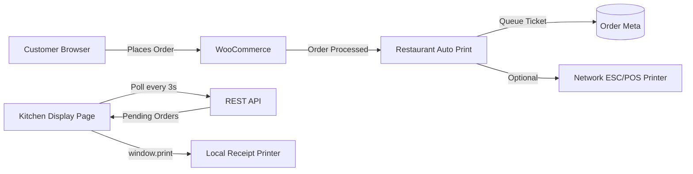

# Restaurant Online Ordering System

A complete WordPress + WooCommerce restaurant ordering system with **automatic kitchen ticket printing** as soon as orders are placed.

## Features

- **Online menu & ordering** — WooCommerce-powered storefront with pickup, delivery, and dine-in options
- **Automatic ticket printing** — Kitchen display page polls for new orders and auto-prints tickets
- **Network thermal printer support** — Optional ESC/POS printing directly to network receipt printers (port 9100)
- **Restaurant checkout fields** — Order type, table number, and pickup time
- **One-click setup** — Sample menu, categories, shipping methods, and theme configuration
- **Kitchen display** — Real-time order queue with sound alerts

## Architecture



## Quick Start

### Prerequisites

- [Docker](https://docs.docker.com/get-docker/) and Docker Compose
- 4 GB RAM recommended

### 1. Configure environment

```bash
cd restaurant-ordering
cp .env.example .env
# Edit .env to change passwords and ports if needed
```

### 2. Run setup

```bash
chmod +x scripts/setup.sh
./scripts/setup.sh
```

This will:

1. Start WordPress + MySQL via Docker
2. Install WordPress and WooCommerce
3. Activate the custom plugins and theme
4. Create a sample restaurant menu
5. Configure kitchen printer settings

### 3. Open the store

| URL | Purpose |
|-----|---------|
| `http://localhost:8080` | Customer storefront / menu |
| `http://localhost:8080/wp-admin` | WordPress admin |
| `http://localhost:8080/kitchen-display/` | Kitchen auto-print display |

Default admin credentials (change in `.env`):

- **Username:** `admin`
- **Password:** `admin123`

## Automatic Ticket Printing

### Method 1: Kitchen Display (Recommended)

Best for most restaurants. Works with any printer connected to a kitchen computer.

1. Connect a receipt printer to the kitchen computer
2. Set it as the **default printer** in your OS
3. Open `http://your-site.com/kitchen-display/` in Chrome or Edge
4. Click **Test Print** to verify
5. Leave the tab open during service

When a customer places an order:

1. WooCommerce processes the checkout
2. The order is queued for printing (`_rap_ticket_queued`)
3. The kitchen display polls the REST API every 3 seconds
4. New orders trigger a sound alert and **automatic `window.print()`**
5. The order is marked as printed

Configure settings at **WooCommerce → Kitchen Printer**.

### Method 2: Network Thermal Printer

For ESC/POS compatible network printers (Epson, Star, etc.) on port 9100.

1. Go to **WooCommerce → Kitchen Printer**
2. Enable **Network Thermal Printer**
3. Enter the printer IP address (e.g. `192.168.1.100`)
4. Save settings

Tickets print **immediately** when an order is placed — no kitchen display needed.

## Customer Ordering Flow

1. Customer browses the menu at `/shop`
2. Adds items to cart and checks out
3. Selects order type: **Pickup**, **Delivery**, or **Dine-in**
4. Optionally enters table number or pickup time
5. Completes payment (configure gateways in WooCommerce settings)
6. Kitchen ticket prints automatically

## Project Structure

```
restaurant-ordering/
├── docker-compose.yml          # WordPress + MySQL stack
├── .env.example                # Environment configuration
├── scripts/setup.sh            # Automated installation
└── wp-content/
    ├── plugins/
    │   ├── restaurant-auto-print/    # Auto-print plugin
    │   └── restaurant-menu-setup/    # Sample menu & config
    └── themes/
        └── restaurant-ordering/        # Storefront theme
```

## Customization

### Add menu items

Use **Products → Add New** in WordPress admin, or edit `restaurant-menu-setup.php` and re-run setup.

### Change print polling interval

**WooCommerce → Kitchen Printer → Poll Interval** (default: 3 seconds)

### Re-print an order

In WooCommerce admin, change the order status away from and back to **Processing** to re-queue the ticket.

### Ticket format

Edit `wp-content/plugins/restaurant-auto-print/templates/kitchen-ticket.php` for HTML tickets, or `includes/class-ticket-renderer.php` for ESC/POS format.

## Development

```bash
# Start containers
docker compose up -d

# WP-CLI commands
docker compose exec -u www-data wpcli wp plugin list
docker compose exec -u www-data wpcli wp wc shop_order list

# View logs
docker compose logs -f wordpress

# Stop
docker compose down
```

Plugin and theme files are mounted as volumes — edit locally and refresh the browser.

## Production Deployment

For production:

1. Use a proper domain with HTTPS (Let's Encrypt)
2. Change all default passwords in `.env`
3. Use a managed WordPress host or hardened Docker deployment
4. Configure a real payment gateway (Stripe, Square, etc.)
5. Set a strong **Kitchen API Secret**
6. Use a dedicated kitchen tablet/PC for the kitchen display page

## Troubleshooting

| Issue | Solution |
|-------|----------|
| Kitchen display shows "Offline" | Check that the API secret matches; verify REST API is accessible |
| Tickets don't auto-print | Ensure the kitchen tab is open, auto-print is enabled, and a default printer is set |
| `/kitchen-display/` returns 404 | Go to **Settings → Permalinks** and click Save, or run `wp rewrite flush` |
| Network printer not printing | Verify printer IP, port 9100 is open, and WordPress container can reach the printer network |

## License

MIT
