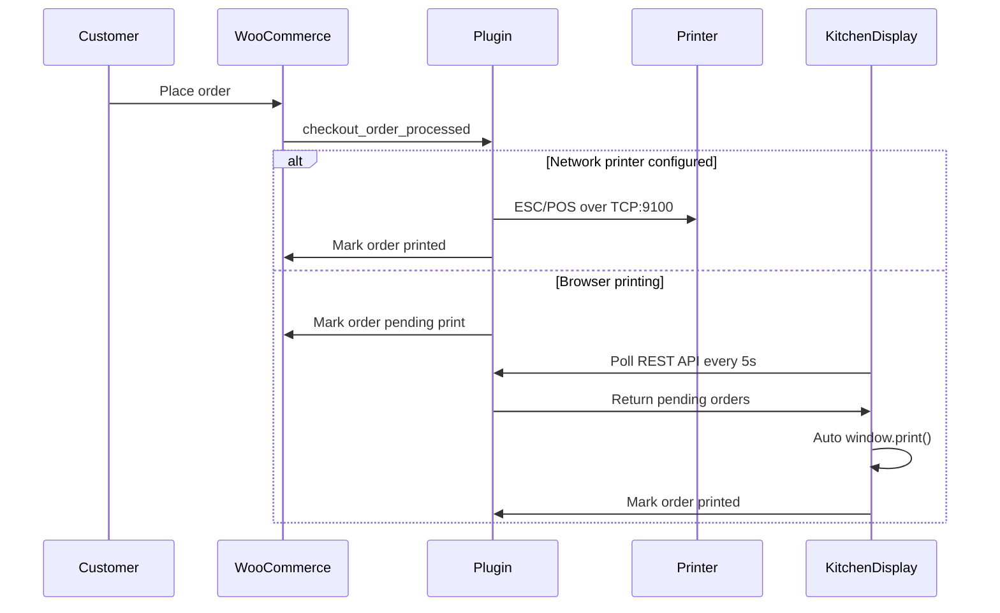

# Restaurant Online Ordering System

WordPress + WooCommerce restaurant ordering with **automatic kitchen ticket printing** as soon as a customer places an order.

## What's Included

- **Docker stack** — WordPress, MySQL, and one-time WooCommerce setup
- **Restaurant Order System plugin** — custom WooCommerce extension with:
  - Pickup, delivery, and dine-in order types
  - Scheduled time, table number, and special instructions at checkout
  - **Kitchen Display** admin page that polls for new orders and auto-prints tickets
  - **Network thermal printer** support (ESC/POS over port 9100)
  - 80mm receipt-style kitchen ticket layout
  - Sample menu seeded on first setup

## Quick Start

### Prerequisites

- [Docker](https://docs.docker.com/get-docker/) and Docker Compose

### 1. Configure environment

```bash
cd wordpress
cp .env.example .env
# Edit .env — change WP_ADMIN_PASSWORD and other values
```

### 2. Start the stack

```bash
docker compose up -d
```

Wait ~60 seconds for WordPress, WooCommerce, and the sample menu to install.

### 3. Open your site

| URL | Purpose |
|-----|---------|
| http://localhost:8080 | Customer ordering (shop front) |
| http://localhost:8080/wp-admin | WordPress admin |
| http://localhost:8080/shop | WooCommerce shop page |

**Default admin login** (change in `.env` before first run):

- Username: `admin`
- Password: `changeme`

### 4. Enable kitchen auto-printing

1. Log in to **WP Admin → WooCommerce → Kitchen Display**
2. Keep that page open on a kitchen computer or tablet
3. Set your thermal printer as the **default system printer**
4. Place a test order from the shop — a ticket prints automatically

For network printers (Epson, Star, etc. on your LAN):

1. Go to **WooCommerce → Restaurant**
2. Enter the printer IP address (port 9100)
3. Tickets print server-side immediately when orders arrive — no browser needed

## How Auto-Printing Works



## Restaurant Checkout Fields

Customers choose:

- **Order type** — Pickup, Delivery, or Dine In
- **Requested time** — ASAP or a specific time
- **Table number** — required for dine-in
- **Special instructions** — allergies, modifications, etc.

These appear on kitchen tickets and in the WooCommerce order admin.

## Plugin Structure

```
wp-content/plugins/restaurant-order-system/
├── restaurant-order-system.php    # Main plugin bootstrap
├── includes/
│   ├── class-ros-checkout.php   # Restaurant checkout fields
│   ├── class-ros-order-hooks.php # Order status + print queue
│   ├── class-ros-ticket-renderer.php # HTML + ESC/POS tickets
│   ├── class-ros-printer.php    # Network printer dispatch
│   ├── class-ros-kds-page.php   # Kitchen Display UI
│   └── class-ros-rest-api.php   # Polling API for KDS
├── templates/kitchen-ticket.php   # Printable ticket template
└── assets/                        # KDS CSS + auto-print JS
```

## Manual Plugin Install

If you already have WordPress + WooCommerce:

1. Copy `wp-content/plugins/restaurant-order-system/` into your WordPress `wp-content/plugins/` directory
2. Activate **Restaurant Order System** in Plugins
3. Ensure WooCommerce is installed and active
4. Open **WooCommerce → Kitchen Display** on your kitchen device

## Customization

### Menu

Add products in **Products → Add New**, or run the seed script:

```bash
docker compose run --rm wpcli wp eval-file /scripts/seed-menu.php --allow-root
```

### Ticket layout

Edit `templates/kitchen-ticket.php` for browser printing, or `class-ros-ticket-renderer.php` for ESC/POS output.

### Poll interval

**WooCommerce → Restaurant** → Kitchen Display Poll Interval (default: 5 seconds).

## Silent Printing (Chrome)

For hands-free kitchen printing without a print dialog:

1. Install [Google Chrome](https://www.google.com/chrome/)
2. Create a shortcut with: `--kiosk-printing`
3. Open Kitchen Display in that Chrome instance
4. Set your thermal printer as default

## Troubleshooting

| Issue | Fix |
|-------|-----|
| Tickets don't print | Confirm Kitchen Display page is open and you're logged in as admin |
| Network printer fails | Verify printer IP, port 9100, and that WordPress container can reach the LAN |
| WooCommerce missing | Run `docker compose run --rm wpcli wp plugin install woocommerce --activate --allow-root` |
| Reset setup | `docker compose down -v` then `docker compose up -d` |

## Stop / Remove

```bash
docker compose down      # Stop containers
docker compose down -v   # Stop and delete all data
```

## License

GPL-2.0-or-later
